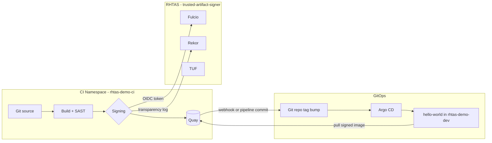

# Architecture

## End-to-end flow



## Three signing paths

### Scenario 1 — Jenkins (explicit cosign)

```
Jenkins agent pod
  └─ ServiceAccount: rhtas-signer
       └─ TokenRequest (audience=sigstore)
            └─ cosign sign --identity-token=$TOKEN
                 └─ Fulcio → Rekor → signature on Quay
```

The pipeline **owns** the sign step. SAST must pass before signing runs.

### Scenario 2 — Tekton Chains (implicit)

```
PipelineRun → build task pushes image
                    ↓
              Tekton Chains controller (observes TaskRun)
                    ↓
              cosign sign via Chains signer config (RHTAS Fulcio keyless)
                    ↓
              signature attached to same Quay repo
```

No `cosign` command in Pipeline YAML. Chains uses the **TaskRun's ServiceAccount** for registry auth and OIDC signing identity.

### Scenario 3 — SPIFFE workload identity

```
ClusterSPIFFEID registers workload selectors
        ↓
SPIRE issues JWT-SVID (SPIFFE ID)
        ↓
cosign detects SPIFFE provider OR pipeline passes JWT-SVID
        ↓
Fulcio trusts SPIFFE OIDC discovery (federated issuer)
        ↓
Certificate identity = spiffe://<trust-domain>/ns/.../sa/...
```

Signing is **automatic** inside a SPIFFE-enabled signer workload; no long-lived cosign keys.

## GitOps last mile

All scenarios converge on the same pattern:

1. CI pushes `quay.io/<org>/rhtas-hello-world:<tag>`
2. CI updates `gitops/manifests/hello-world/kustomization.yaml` with new tag
3. Argo CD syncs `rhtas-demo-dev` namespace
4. App serves `/` with build version + signer metadata from env vars

## Security boundaries

| Asset | Storage | Rotation |
|-------|---------|----------|
| Quay robot password | OpenShift Secret | Quay UI / token regen |
| SA signing token | Ephemeral TokenRequest (~1h) | Per pipeline run |
| SPIFFE JWT-SVID | SPIRE agent socket / CSI volume | Auto-rotated (~5m) |
| cosign private key | **Not used** in these demos (keyless) | N/A |

## Namespace map

```
trusted-artifact-signer   RHTAS (Fulcio, Rekor, TUF)
rhtas-demo-ci             Jenkins / Tekton / signer workloads
rhtas-demo-dev            GitOps-deployed application
spire-system              SPIRE server/agent (Scenario 3)
openshift-pipelines       Chains config (Scenario 2)
openshift-gitops          Argo CD
```
