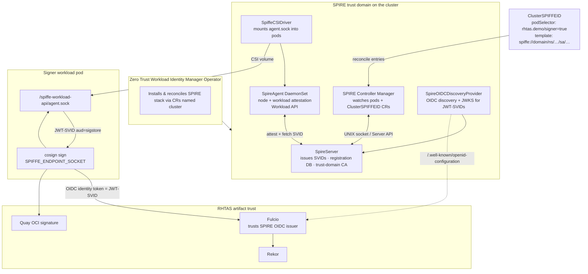
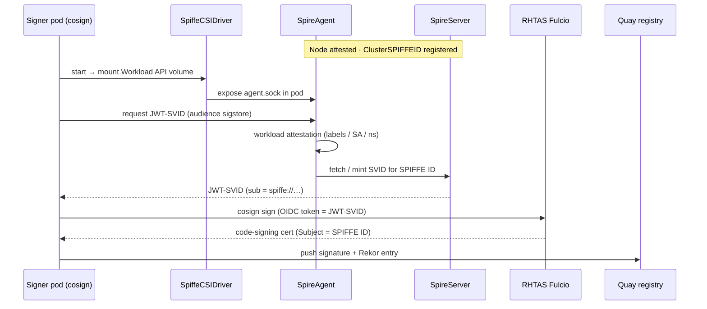

# Scenario 3 — SPIFFE workload identity with automatic cosign signing

Demonstrates **Zero Trust Workload Identity Manager** (SPIFFE/SPIRE) issuing short-lived JWT-SVIDs to a signer workload. Cosign uses the SPIFFE identity automatically — no manual TokenRequest script, no static keys.

## What this proves

- Workload attestation before identity issuance (SPIRE)
- SPIFFE ID as Fulcio certificate identity
- Federation between SPIRE OIDC discovery and RHTAS Fulcio
- Signing happens inside an attested pod without human or Jenkins credentials

## Architecture

Based on the [Zero Trust Workload Identity Manager](https://docs.redhat.com/en/documentation/openshift_container_platform/4.20/html/security_and_compliance/zero-trust-workload-identity-manager) (OCP 4.20) overview: the Operator manages the SPIFFE Runtime Environment (SPIRE), which issues short-lived **SVIDs** (X.509 or JWT) to attested workloads.

### What each component does

| Component | CR (name `cluster`) | Role |
|-----------|---------------------|------|
| **SPIFFE** | — (standard) | Framework that assigns unique IDs (`spiffe://…`) carried in SVIDs |
| **SPIRE Server** | `SpireServer` | Trust-domain CA: issues identities, holds registration entries & signing keys |
| **SPIRE Agent** | `SpireAgent` | DaemonSet per node: node + workload attestation; serves the Workload API |
| **SPIFFE CSI Driver** | `SpiffeCSIDriver` | Mounts the Workload API socket into pods (ephemeral CSI volume) |
| **SPIRE OIDC Discovery Provider** | `SpireOIDCDiscoveryProvider` | Exposes OIDC endpoints so JWT-SVIDs work with Fulcio / other OIDC clients |
| **SPIRE Controller Manager** | (runs with Server) | Watches pods / `ClusterSPIFFEID` CRs and reconciles registration entries |
| **ClusterSPIFFEID** | `spire.spiffe.io` | Policy: which pods get which SPIFFE ID template (this demo’s registration) |

**Attestation** (before any SVID is issued):

1. **Node attestation** — prove the node is trusted before its Agent may request identities  
2. **Workload attestation** — prove the pod matches selectors (labels, SA, namespace) before issuing an SVID  

### Component diagram



### Identity flow (this demo)



## Prerequisites

- Cluster-admin on OpenShift 4.20+
- [Zero Trust Workload Identity Manager](https://docs.redhat.com/en/documentation/openshift_container_platform/4.20/html/security_and_compliance/zero-trust-workload-identity-manager) Operator installed (CSV `Succeeded`)
- RHTAS (`trusted-artifact-signer`) Ready — Fulcio / Rekor / TUF routes
- Quay robot secret `quay-credentials` in `rhtas-demo-ci`

## Setup SPIFFE (required before cosign)

Follow the [product deploy order](https://docs.redhat.com/en/documentation/openshift_container_platform/4.20/html/security_and_compliance/zero-trust-workload-identity-manager): Operator → `ZeroTrustWorkloadIdentityManager` → `SpireServer` → `SpireAgent` → `SpiffeCSIDriver` → `SpireOIDCDiscoveryProvider` → `ClusterSPIFFEID` → Fulcio federation → pipeline.

All SPIRE CRs **must** be named `cluster`.

### 0. Export cluster values

```bash
cd scenario-3-spiffe

export APP_DOMAIN=$(oc get ingresses.config.openshift.io cluster -o jsonpath='{.spec.domain}')
# RH recommends trustDomain == apps domain
export TRUST_DOMAIN="${APP_DOMAIN}"
export CLUSTER_NAME=$(oc get infrastructure cluster -o jsonpath='{.status.infrastructureName}' | cut -c1-63)
export JWT_ISSUER="https://oidc-discovery.${APP_DOMAIN}"
export STORAGE_CLASS=$(oc get sc -o jsonpath='{.items[?(@.metadata.annotations.storageclass\.kubernetes\.io/is-default-class=="true")].metadata.name}')
# fallback if no default SC annotated:
: "${STORAGE_CLASS:=$(oc get sc -o jsonpath='{.items[0].metadata.name}')}"

echo "TRUST_DOMAIN=$TRUST_DOMAIN"
echo "CLUSTER_NAME=$CLUSTER_NAME"
echo "JWT_ISSUER=$JWT_ISSUER"
echo "STORAGE_CLASS=$STORAGE_CLASS"
```

`jwtIssuer` is the **OIDC Discovery Provider route URL**, not the SPIFFE trust domain string.

### 1. Confirm the Operator is installed

```bash
oc get csv -n zero-trust-workload-identity-manager \
  -l operators.coreos.com/openshift-zero-trust-workload-identity-manager.zero-trust-workload-identity-manager
# PHASE must be Succeeded

oc get crd spireservers.operator.openshift.io clusterspiffeids.spire.spiffe.io
```

Install from OperatorHub if missing: **Zero Trust Workload Identity Manager** (stable-v1).

### 2. Deploy the SPIRE stack

Templates live in `openshift/spire/` (`${VAR}` placeholders). Render and apply:

```bash
apply_spire() {
  envsubst < "$1" | oc apply -f -
}

apply_spire openshift/spire/00-ztwim.yaml
apply_spire openshift/spire/01-spire-server.yaml
apply_spire openshift/spire/02-spire-agent.yaml   # includes create-only annotation
apply_spire openshift/spire/03-spiffe-csi-driver.yaml
apply_spire openshift/spire/04-spire-oidc-discovery.yaml
```

Wait until Server / Agent / CSI are up:

```bash
oc get zerotrustworkloadidentitymanagers,spireservers,spireagents,\
spiffecsidrivers,spireoidcdiscoveryproviders -A
oc get po -n zero-trust-workload-identity-manager
```

#### 2b. Agent node DNS (`hostAliases`) — required on most lab / SNO clusters

On clusters where the node hostname is **not** in CoreDNS, the agent cannot reach kubelet (`lookup <nodeName>: no such host`), so the OIDC provider stays `0/1` with `no identity issued`.

`SpireAgent` has no CR field for this. The setup script:

1. Sets **`CREATE_ONLY_MODE=true`** on the ZTWIM Subscription (the CR annotation alone does **not** stop the Operator from wiping DaemonSet patches)
2. Patches the agent DaemonSet with `hostAliases` (node name → InternalIP)
3. Restarts agent + OIDC pods

```bash
./openshift/spire/apply-agent-config.sh
```

Confirm OIDC is Ready:

```bash
oc get deploy spire-spiffe-oidc-discovery-provider -n zero-trust-workload-identity-manager
# READY 1/1
oc get ds spire-agent -n zero-trust-workload-identity-manager -o jsonpath='{.spec.template.spec.hostAliases}{"\n"}'
# must be non-empty

curl -sS "${JWT_ISSUER}/.well-known/openid-configuration" | head
```

### 3. Register the cosign signer workload (`ClusterSPIFFEID`)

```bash
oc apply -f openshift/namespace.yaml   # ensures rhtas-demo-ci exists + label

envsubst < openshift/clusterspiffeid-tekton-signer.yaml | oc apply -f -
oc get clusterspiffeids
```

Pods labeled `rhtas.demo/signer=true` in `rhtas-demo-ci` receive:

```text
spiffe://<TRUST_DOMAIN>/ns/rhtas-demo-ci/sa/spiffe-cosign-signer
```

### 4. Federate SPIRE OIDC with RHTAS Fulcio

Fulcio must trust `$JWT_ISSUER` so Cosign can exchange a JWT-SVID for a signing cert. `Type: uri` matches SPIFFE ID subjects (`spiffe://…`).

```bash
# Preview patch (substitutes JWT_ISSUER)
envsubst < openshift/fulcio-spire-oidc-patch.json

oc patch securesign securesign-sample -n trusted-artifact-signer --type=json \
  --patch "$(envsubst < openshift/fulcio-spire-oidc-patch.json)"

# Confirm kubernetes (Scenario 2) + SPIRE issuers both present:
oc get cm -n trusted-artifact-signer -l rhtas.redhat.com/resource=server-config \
  -o jsonpath='{.items[-1:].data.config\.yaml}{"\n"}'
```

### 5. Deploy the SPIFFE cosign pipeline

```bash
# Build tasks (git-clone, maven, semgrep, buildah-push) — local copy of Scenario 2 tasks
oc apply -f openshift/tasks.yaml

oc apply -f openshift/spiffe-signer-sa.yaml
oc apply -f openshift/scc-spiffe-signer.yaml
oc adm policy add-scc-to-user pipelines-scc \
  -z spiffe-cosign-signer -n rhtas-demo-ci
oc secrets link spiffe-cosign-signer quay-credentials -n rhtas-demo-ci --for=pull,mount

oc apply -f openshift/tasks-spiffe.yaml
oc apply -f openshift/pipeline-spiffe.yaml
```

### 6. Run (cosign signs with SPIFFE — no TokenRequest)

Cosign 3 puts Fulcio / Rekor / OIDC in a **signing config** (not `--fulcio-url` / `--rekor-url` /
`--oidc-issuer`). The task runs `cosign signing-config create` for RHTAS + SPIRE, then
`cosign sign --signing-config=…`.

```bash
export FULCIO_URL=$(oc get fulcio -n trusted-artifact-signer -o jsonpath='{.items[0].status.url}')
export REKOR_URL=$(oc get rekor -n trusted-artifact-signer -o jsonpath='{.items[0].status.url}')
export TUF_URL=$(oc get tuf -n trusted-artifact-signer -o jsonpath='{.items[0].status.url}')
export TUF_ROOT_CHECKSUM=$(curl -sS "${TUF_URL}/1.root.json" | sha256sum | awk '{print $1}')

tkn pipeline start rhtas-hello-world-spiffe \
  -n rhtas-demo-ci \
  --param quay-org=rhn_support_jeretan \
  --param quay-repo=hello-world-cosign \
  --param spire-oidc-issuer="${JWT_ISSUER}" \
  --param fulcio-url="${FULCIO_URL}" \
  --param rekor-url="${REKOR_URL}" \
  --param tuf-url="${TUF_URL}" \
  --param tuf-root-checksum="${TUF_ROOT_CHECKSUM}" \
  --param git-url=https://github.com/navyseal8/rhtas-cosign-openshift.git \
  --param git-revision=main \
  --workspace name=shared-workspace,volumeClaimTemplateFile=openshift/workspace-pvc.yaml \
  --workspace name=docker-credentials,secret=quay-credentials \
  --workspace name=git-credentials,secret=github-credentials \
  --showlog
```

Do **not** pass a global `--serviceaccount=spiffe-cosign-signer` — that forces *every* task
(including semgrep) onto the signer SA. The Pipeline already sets that SA only on
`build-push` and `spiffe-sign`. If you do use a global SA, re-apply `openshift/tasks.yaml`
(writable `HOME` on `sast-semgrep`) and grant that SA `pipelines-scc` for Buildah.

The `spiffe-sign` task mounts `csi.spiffe.io`, sets `SPIFFE_ENDPOINT_SOCKET`, initializes TUF,
builds a signing config, then runs `cosign sign` so Cosign fetches a JWT-SVID automatically
(audience `sigstore`).

## Verify

Use the same RHTAS trust material as Scenario 2 (`rhtas-trust` ConfigMap / TUF init), but with the **SPIFFE** identity and **SPIRE** OIDC issuer:

```bash
IMAGE=quay.io/rhn_support_jeretan/hello-world-cosign@sha256:<digest>
REKOR=$(oc get rekor -n trusted-artifact-signer -o jsonpath='{.items[0].status.url}')

cosign verify \
  --rekor-url="$REKOR" \
  --certificate-identity-regexp="^spiffe://${TRUST_DOMAIN}/ns/rhtas-demo-ci/sa/spiffe-cosign-signer$" \
  --certificate-oidc-issuer="${JWT_ISSUER}" \
  "$IMAGE"
```

In-cluster verify: reuse the Scenario 2 `hi/cosign` pod pattern; change identity / issuer flags to the SPIFFE values above.

## Comparison across scenarios

| | S1 Jenkins | S2 Chains | S3 SPIFFE |
|---|------------|-----------|-----------|
| Identity | K8s SA `rhtas-signer` | `tekton-chains-controller` | SPIFFE ID |
| Token minting | `oc create token` in pipeline | Chains controller | SPIRE agent (auto) |
| Attestation | RBAC only | TaskRun metadata | SPIRE node/workload attestation |
| cosign invocation | Explicit in Jenkinsfile | Chains controller | `spiffe-sign` task |

## Files

| File | Description |
|------|-------------|
| `openshift/spire/*.yaml` | ZTWIM + SPIRE CRs (envsubst templates) |
| `openshift/spire/apply-agent-config.sh` | Patches agent DaemonSet `hostAliases` + restarts pods |
| `openshift/clusterspiffeid-tekton-signer.yaml` | Workload registration for signer pods |
| `openshift/fulcio-spire-oidc-patch.json` | Add SPIRE issuer to Fulcio |
| `openshift/spiffe-signer-sa.yaml` | Signer SA + Quay pull secret |
| `openshift/scc-spiffe-signer.yaml` | Bind signer SA to `pipelines-scc` (Buildah) |
| `openshift/tasks.yaml` | Build tasks (cloned from Scenario 2) |
| `openshift/workspace-pvc.yaml` | Pipeline workspace PVC template |
| `openshift/tasks-spiffe.yaml` | Cosign sign via SPIFFE Workload API |
| `openshift/pipeline-spiffe.yaml` | Build + push + SPIFFE sign |
| `docs/spiffe-workload-signing.md` | Deeper OIDC / automatic signing notes |

## SPIFFE troubleshooting

| Symptom | Check |
|---------|-------|
| `the server doesn't have a resource type "spiffeid"` | Use `clusterspiffeids` / `spireservers` (not legacy names) |
| CSI mount fails / no `agent.sock` | `SpiffeCSIDriver` + `SpireAgent` Ready; pod has `rhtas.demo/signer=true` |
| OIDC deploy `0/1`, logs `no identity issued` / agent `lookup <node>: no such host` | Run `./openshift/spire/apply-agent-config.sh` (DaemonSet `hostAliases` + create-only). Label is `app.kubernetes.io/name=spire-agent`. |
| Fulcio rejects JWT | `$JWT_ISSUER` on Fulcio matches discovery `issuer`; `ClientID: sigstore` |
| Wrong SPIFFE ID in cert | `ClusterSPIFFEID` template / `TRUST_DOMAIN` / SA name |
| OIDC curl fails | `managedRoute: true`; wait for route; check TLS / DNS |
| `cannot specify service URLs and use signing config` | Do not pass `--fulcio-url` / `--rekor-url` / `--oidc-issuer` with Cosign 3 — use `cosign signing-config create` + `--signing-config` |
| Root checksum deprecation warning | Pass `tuf-root-checksum` (`sha256` of `${TUF_URL}/1.root.json`) |
| Quay `UNAUTHORIZED` on `cosign sign` | `$DOCKER_CONFIG/config.json` must be readable by the cosign UID; keep auth off `$HOME/.docker` so Tekton cred copy is not blocked. Confirm `quay-credentials` linked to signer SA |