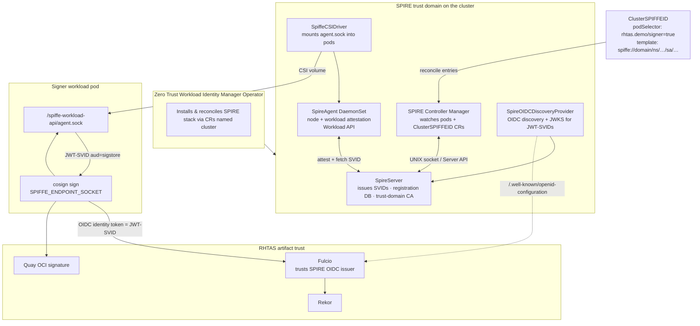
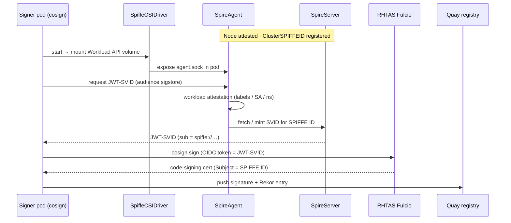

# Scenario 3 — SPIFFE workload identity with automatic cosign signing

Demonstrates **Zero Trust Workload Identity Manager** (SPIFFE/SPIRE) issuing short-lived JWT-SVIDs to a signer workload. Cosign uses the SPIFFE identity automatically — no manual TokenRequest script, no static keys.

## What this proves

- Workload attestation before identity issuance (SPIRE)
- SPIFFE ID as Fulcio certificate identity
- Federation between SPIRE OIDC discovery and RHTAS Fulcio
- Signing happens inside an attested pod without human or Jenkins credentials

## Architecture

Based on the [Zero Trust Workload Identity Manager](https://docs.redhat.com/en/documentation/openshift_container_platform/4.20/html/security_and_compliance/zero-trust-workload-identity-manager) (OCP 4.20) overview: the Operator manages the SPIFFE Runtime Environment (SPIRE), which issues short-lived **SVIDs** (X.509 or JWT) to attested workloads.

### What each component does

| Component | CR (name `cluster`) | Role |
|-----------|---------------------|------|
| **SPIFFE** | — (standard) | Framework that assigns unique IDs (`spiffe://…`) carried in SVIDs |
| **SPIRE Server** | `SpireServer` | Trust-domain CA: issues identities, holds registration entries & signing keys |
| **SPIRE Agent** | `SpireAgent` | DaemonSet per node: node + workload attestation; serves the Workload API |
| **SPIFFE CSI Driver** | `SpiffeCSIDriver` | Mounts the Workload API socket into pods (ephemeral CSI volume) |
| **SPIRE OIDC Discovery Provider** | `SpireOIDCDiscoveryProvider` | Exposes OIDC endpoints so JWT-SVIDs work with Fulcio / other OIDC clients |
| **SPIRE Controller Manager** | (runs with Server) | Watches pods / `ClusterSPIFFEID` CRs and reconciles registration entries |
| **ClusterSPIFFEID** | `spire.spiffe.io` | Policy: which pods get which SPIFFE ID template (this demo’s registration) |

**Attestation** (before any SVID is issued):

1. **Node attestation** — prove the node is trusted before its Agent may request identities  
2. **Workload attestation** — prove the pod matches selectors (labels, SA, namespace) before issuing an SVID  

### Component diagram



### Identity flow (this demo)



## Prerequisites

- [Zero Trust Workload Identity Manager](https://docs.redhat.com/en/documentation/openshift_container_platform/4.20/html/security_and_compliance/zero-trust-workload-identity-manager) installed
- SPIRE stack deployed (`SpireServer` / `SpireAgent` / `SpiffeCSIDriver` / `SpireOIDCDiscoveryProvider`, each named `cluster`)
- Trust domain configured (e.g. `spiffe://prod.example.com`)
- RHTAS Fulcio configured with an **additional** OIDC issuer for the SPIRE OIDC discovery endpoint

## Setup

### 1. Install Workload Identity Manager

```bash
# OperatorHub → Zero Trust Workload Identity Manager
# Then create SpireServer, SpireAgent, SpiffeCSIDriver, SpireOIDCDiscoveryProvider
# (each named "cluster") per product docs.

oc get zerotrustworkloadidentitymanagers,spireservers,spireagents,\
spiffecsidrivers,spireoidcdiscoveryproviders,clusterspiffeids -A
```

### 2. Register signer workload identity

```bash
oc apply -f openshift/clusterspiffeid-tekton-signer.yaml
```

This maps pods with label `rhtas.demo/signer: "true"` to:

```
spiffe://<trust-domain>/ns/rhtas-demo-ci/sa/spiffe-cosign-signer
```

### 3. Federate SPIRE OIDC with RHTAS Fulcio

Add SPIRE's OIDC discovery URL to `Securesign` Fulcio `OIDCIssuers`:

```yaml
- Issuer: "https://oidc-discovery.<spire-domain>"
  IssuerURL: "https://oidc-discovery.<spire-domain>"
  ClientID: "trusted-artifact-signer"
  Type: email   # or per SPIRE JWT-SVID claims documentation
```

See [docs/spiffe-workload-signing.md](docs/spiffe-workload-signing.md).

### 4. Deploy SPIFFE-enabled pipeline

```bash
# Reuse build tasks from Scenario 2
oc apply -f ../scenario-2-tekton/openshift/tasks.yaml

oc apply -f openshift/namespace.yaml
oc apply -f openshift/spiffe-signer-sa.yaml
oc apply -f openshift/tasks-spiffe.yaml
oc apply -f openshift/pipeline-spiffe.yaml
```

### 5. Run

```bash
tkn pipeline start rhtas-hello-world-spiffe \
  -n rhtas-demo-ci \
  --param quay-org=acme \
  --workspace name=shared-workspace,volumeClaimTemplateFile=../scenario-2-tekton/openshift/workspace-pvc.yaml \
  --showlog
```

The `spiffe-sign` task runs **after** image push. Cosign obtains a JWT-SVID from the SPIFFE workload API (`SPIFFE_ENDPOINT_SOCKET`) and signs without a manually passed token.

## Verify

```bash
cosign verify \
  --certificate-identity-regexp='^spiffe://.*/ns/rhtas-demo-ci/sa/spiffe-cosign-signer$' \
  --certificate-oidc-issuer="https://oidc-discovery.<spire-domain>" \
  quay.io/acme/rhtas-hello-world:spiffe-<run-id>
```

## Comparison across scenarios

| | S1 Jenkins | S2 Chains | S3 SPIFFE |
|---|------------|-----------|-----------|
| Identity | K8s SA `rhtas-signer` | K8s SA `tekton-chains-builder` | SPIFFE ID |
| Token minting | `oc create token` in pipeline | Chains controller | SPIRE agent (auto) |
| Attestation | RBAC only | TaskRun metadata | SPIRE node/workload attestation |
| cosign invocation | Explicit in Jenkinsfile | Chains controller | Signer task / ambient |

## Files

| File | Description |
|------|-------------|
| `openshift/clusterspiffeid-tekton-signer.yaml` | SPIFFE registration for signer pods |
| `openshift/pipeline-spiffe.yaml` | Build + push + SPIFFE-aware sign |
| `docs/spiffe-workload-signing.md` | OIDC federation and automatic signing flow |
